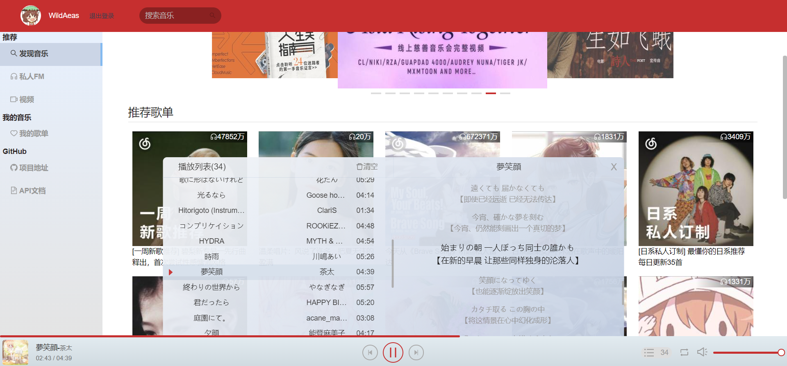

# React Music
基于 React + JavaScript 的仿网易云音乐播放器，使用一行 npm 命令即可在本地运行前后端。

技术栈: React(hooks) + axios + antd + Sass

## 预览
<a href="https://lisianthus-a.github.io/react-music/#/Discovery" target="_blank">在线预览</a>（服务器部署在 heroku，国内网络可能会比较慢）



## Todo
- [x] 脚手架搭建
- [x] NodeJS代理解决API接口跨域问题
- [x] 音乐播放器
    - [x] 开始/暂停
    - [x] 上一首 / 下一首
    - [x] 音量设置
    - [x] 循环模式设置
    - [x] 播放列表
        - [x] 清空播放列表
        - [x] 删除播放列表中的某首歌
        - [x] 下载
        - [x] 添加到歌单
    - [x] 歌词展示
        - [x] 歌词随进度滚动
    - [x] 进度条
        - [x] 歌曲播放进度展示
        - [x] 拖动进度
- [x] 发现音乐页面
    - [x] 图片轮播
    - [x] 推荐歌单
    - [x] 最新音乐
- [x] 歌单详情页面
    - [x] 歌单信息
    - [x] 歌曲列表
    - [x] 评论列表
- [x] 我的歌单页面
    - [x] 查看创建与收藏的歌单
    - [x] 删除歌单
- [x] 歌曲详情页面
    - [x] 歌曲信息
    - [x] 歌曲评论
- [x] 私人FM页面
    - [x] 简化版播放器
- [x] 专辑页面
    - [x] 专辑信息
    - [x] 歌曲列表
    - [x] 评论
- [x] 歌手页面
    - [x] 热门作品
    - [x] 歌手介绍
- [ ] 用户页面
- [ ] 视频页面
- [ ] 搜索页面

## 安装
```
$ git clone https://github.com/Lisianthus-A/react-music.git

$ npm install
```

## 运行
```
$ npm run start
```
运行命令后，在浏览器地址栏输入 `localhost:4000` 即可打开页面。前端默认运行在 4000 端口，后端在 4001 端口。

可在 `./config/webpack.dev.config.js` 和 `./server/app.js` 中修改默认端口。

## API接口
API 来自 [NeteaseCloudMusicApi](https://github.com/Binaryify/NeteaseCloudMusicApi)

[API文档](https://binaryify.github.io/NeteaseCloudMusicApi)

## License
[MIT License](http://opensource.org/licenses/MIT)